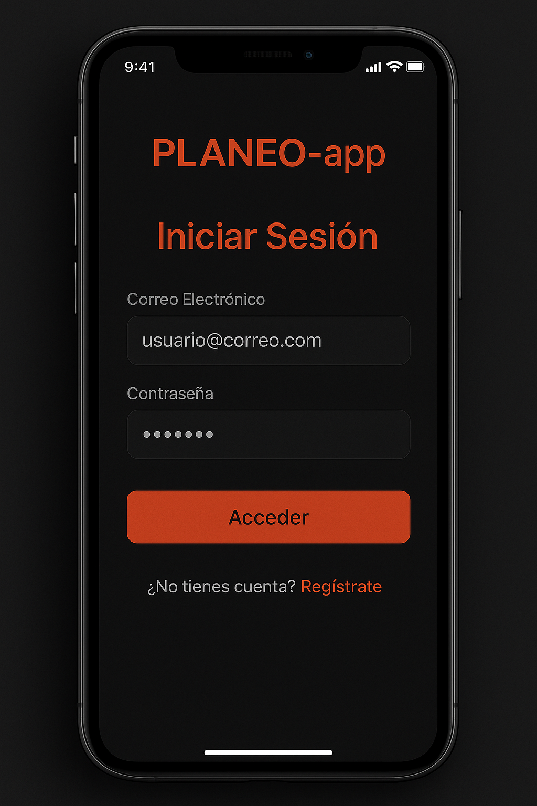
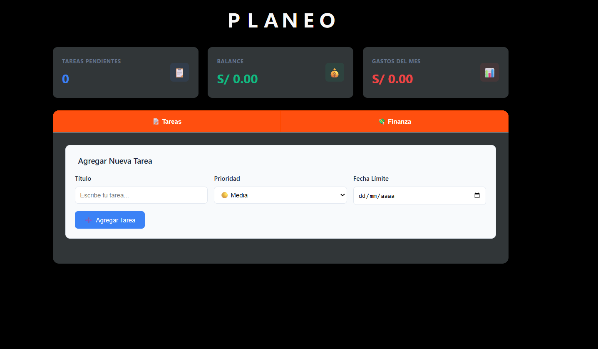
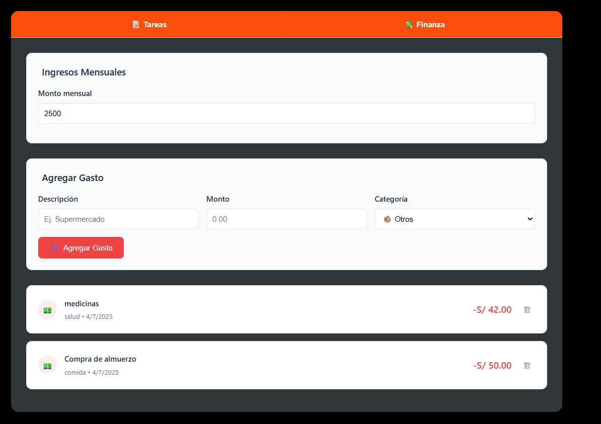

# 🧠 PLANEO-app

**PLANEO** es una aplicación web de productividad desarrollada con Node.js, Express, MongoDB y JavaScript. Su objetivo es ayudarte a **organizar tu día**y administrar tus **gastos** mensuales dentro de la misma interfaz. 

---

## ¿Por qué usar PLANEO?

✔️ Porque la organización no debería ser complicada.  
✔️ Porque necesitas visualizar tus pendientes y tu economía en un solo lugar.  
✔️ Porque controlar tus hábitos es el primer paso para una vida más enfocada.

---

##  Funcionalidades principales

###  Tareas (
- Crear, eliminar y marcar tareas como completadas.
- Asignar prioridad: alta, media o baja.
- Visualización clara con indicadores de prioridad y fecha.

###  Finanzas
- Registrar gastos diarios por categoría.
- Controlar tu balance mensual comparando ingresos y egresos.
- Eliminar gastos fácilmente.

### 🔐 Autenticación
- Registro e inicio de sesión con contraseña encriptada.
- Uso de **JSON Web Tokens (JWT)** para proteger rutas y datos de usuario.
---

### VISTAS DE LA APP
- 
- 
- 
